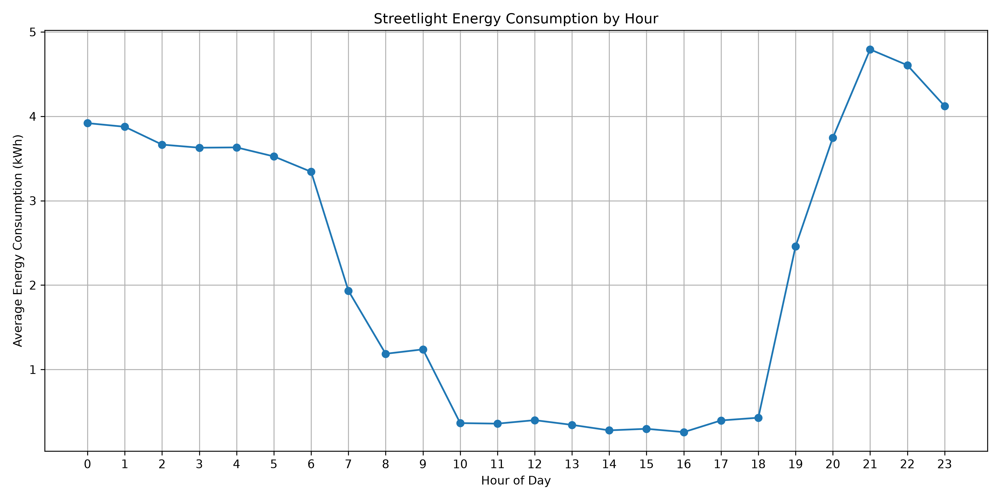
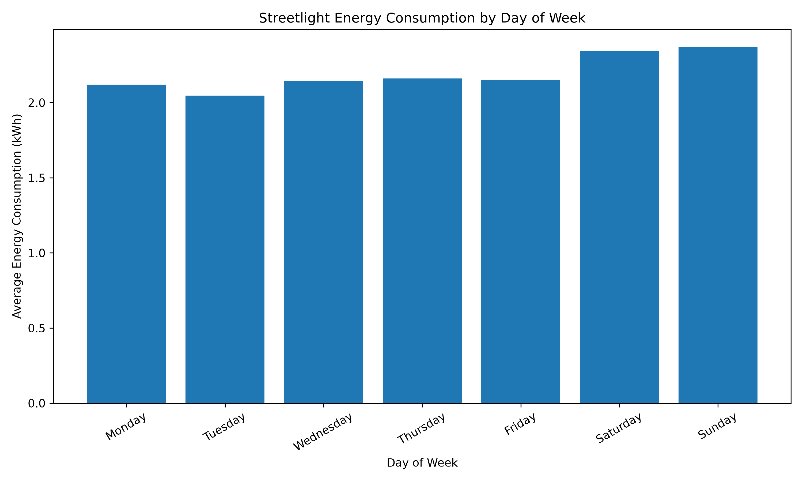
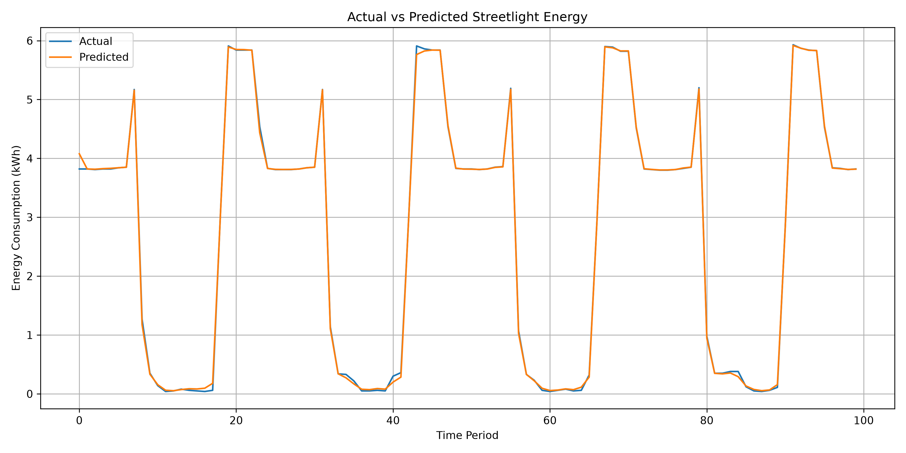
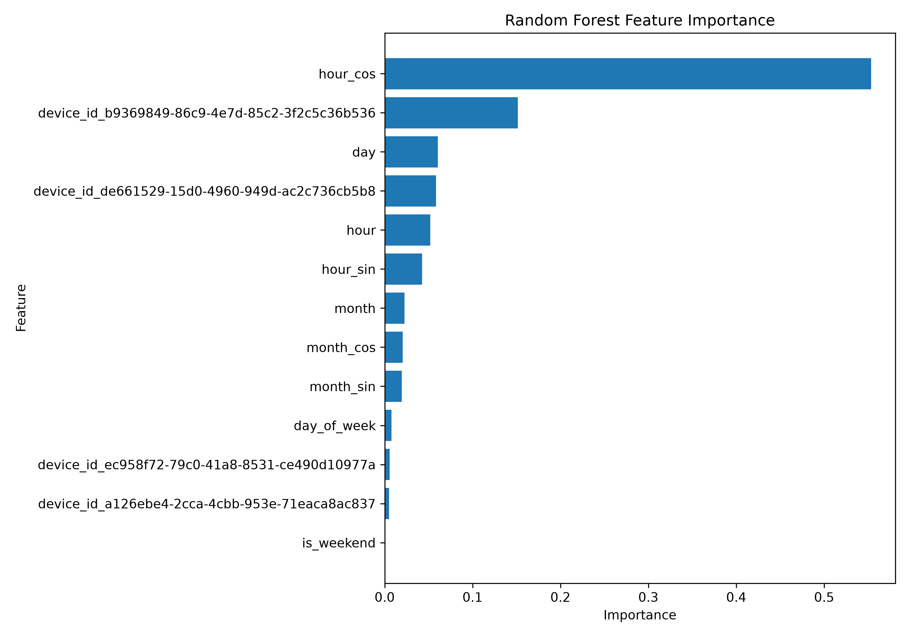
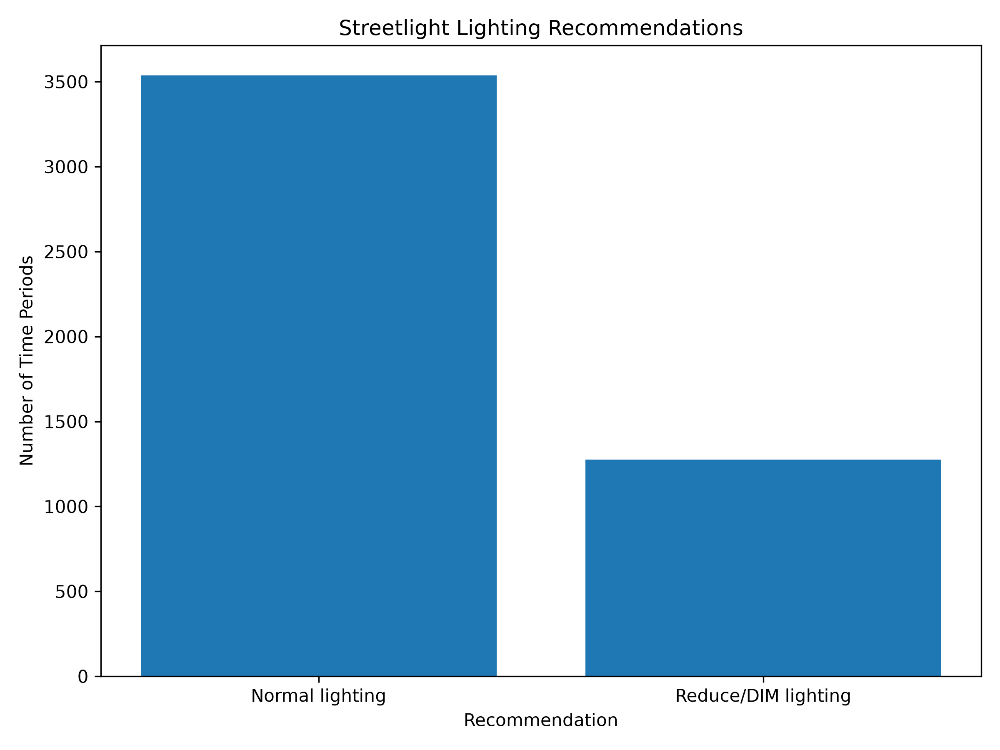

# 💡 Streetlight Energy Optimizer

An AI/ML-based project that predicts **streetlight energy consumption** and provides **lighting optimization recommendations** to help reduce unnecessary electricity usage.

The project uses real-world smart streetlight energy meter data and machine learning techniques to analyze consumption patterns and predict energy demand.

---

## 🚀 Project Overview

Street lighting consumes a significant amount of electricity, especially when lighting operates at full intensity during periods of lower demand.

This project aims to:

* 📊 Analyze streetlight energy consumption patterns
* 🤖 Predict energy consumption using Machine Learning
* 💡 Identify high-energy consumption periods
* ⚡ Provide lighting optimization recommendations
* 📈 Visualize energy consumption trends
* 🌐 Provide an interactive Streamlit application

---

## 🎯 Objectives

1. Collect and preprocess smart streetlight energy meter data.
2. Perform Exploratory Data Analysis (EDA).
3. Create useful time-based and cyclic features.
4. Build Machine Learning models for energy prediction.
5. Compare Linear Regression and Random Forest models.
6. Analyze feature importance.
7. Generate lighting optimization recommendations.
8. Deploy an interactive prediction application using Streamlit.

---

## 📂 Dataset

The project uses the **Zenodo SmartLivingEPC Public Street Lighting dataset**.

Dataset source:

🔗 https://zenodo.org/records/15781077

The dataset contains smart streetlight energy meter readings from multiple devices.

### Dataset columns

| Column      | Description                          |
| ----------- | ------------------------------------ |
| `device_id` | Unique streetlight/device identifier |
| `timestamp` | Date and time of measurement         |
| `meas_type` | Measurement type                     |
| `value`     | Energy meter reading                 |
| `unit`      | Measurement unit                     |

### Dataset processing

The raw dataset contains cumulative meter readings. Energy consumption was calculated using changes between consecutive meter readings for each device.

Negative meter changes caused by meter resets or corrections were removed from the consumption calculation.

---

## 🔄 Machine Learning Workflow

```text
Raw Energy Meter Data
        ↓
Data Loading
        ↓
Data Cleaning
        ↓
Handle Meter Resets
        ↓
Energy Consumption Calculation
        ↓
Outlier Detection
        ↓
Feature Engineering
        ↓
Exploratory Data Analysis
        ↓
Train/Test Split
        ↓
Model Training
        ↓
Model Evaluation
        ↓
Energy Prediction
        ↓
Lighting Recommendation
```

---

## 🧹 Data Preprocessing

The following preprocessing steps were performed:

* Combined multiple energy meter CSV files
* Converted timestamps into datetime format
* Sorted data chronologically
* Calculated energy consumption from meter differences
* Removed invalid negative consumption values
* Handled outliers using the IQR method
* Created time-based features

---

## ⚙️ Feature Engineering

The following features were created from the timestamp:

* `hour`
* `day`
* `month`
* `day_of_week`
* `is_weekend`

Cyclic features were also created to represent the circular nature of time:

* `hour_sin`
* `hour_cos`
* `month_sin`
* `month_cos`

These features help the model understand patterns such as daily and monthly energy consumption cycles.

---

## 🤖 Machine Learning Models

### 1. Linear Regression

Used as the baseline machine learning model.

### 2. Random Forest Regression

A Random Forest model was trained to capture nonlinear relationships between time/device features and energy consumption.

### 3. Improved Random Forest

The model was improved using additional cyclic time features such as:

* `hour_sin`
* `hour_cos`
* `month_sin`
* `month_cos`

---

## 📊 Model Performance

The models were evaluated using:

* MAE — Mean Absolute Error
* RMSE — Root Mean Squared Error
* R² Score

| Model                  |   MAE |  RMSE | R² Score |
| ---------------------- | ----: | ----: | -------: |
| Linear Regression      | ~1.69 | ~1.89 |    ~0.14 |
| Random Forest          | ~0.52 | ~1.19 |    ~0.66 |
| Improved Random Forest | ~0.55 | ~1.14 |    ~0.69 |

The improved Random Forest model achieved an **R² score of approximately 0.69** on the test data.

> These results are based on the available dataset and test split. Performance may vary on new or different streetlight datasets.

---

## 📈 Visualizations

### Energy Consumption by Hour



Shows how streetlight energy consumption varies throughout the day.

---

### Energy Consumption by Day



Shows daily energy consumption patterns in the dataset.

---

### Actual vs Predicted Energy Consumption



Compares actual energy consumption with predictions generated by the machine learning model.

---

### Feature Importance



Shows which features contributed most to the Random Forest model's predictions.

---

### Lighting Recommendations



Provides lighting recommendations based on predicted energy consumption.

---

## 💡 Lighting Optimization

The project categorizes predicted energy consumption into different operating recommendations.

Example:

```text
Low Energy Consumption
        ↓
Normal Lighting

Medium Energy Consumption
        ↓
Monitor / Optimize

High Energy Consumption
        ↓
Reduce / DIM Lighting
```

The recommendations are intended as a **data-driven optimization concept** rather than direct control of physical streetlights.

---

## 📊 Optimization Analysis

A sample optimization analysis was performed using the model predictions.

The test data included approximately:

* **700** normal-operation recommendations
* **263** Reduce/DIM recommendations

This means approximately **27% of the analyzed test observations** were identified for potential lighting reduction under the project's recommendation rules.

> This does not mean that 27% electricity savings were achieved. It represents the proportion of observations classified for potential optimization.

A hypothetical 20% reduction scenario was also analyzed to estimate potential energy savings.

> The estimated savings are a model-based scenario, not measured real-world savings.

---

## 🌐 Streamlit Application

The project includes an interactive **Streamlit** application.

The application allows users to enter streetlight-related information and obtain:

* Predicted energy consumption
* Energy consumption category
* Lighting optimization recommendation

### Run the application

Install the required packages:

```bash
pip install -r requirements.txt
```

Run Streamlit:

```bash
streamlit run app.py
```

The application will open in your web browser.

---

## 🛠️ Technologies Used

### Programming

* Python

### Data Analysis

* Pandas
* NumPy

### Data Visualization

* Matplotlib

### Machine Learning

* Scikit-learn
* Linear Regression
* Random Forest Regression

### Application

* Streamlit

### Development Tools

* Git
* GitHub
* Jupyter Notebook / Python

---

## 📁 Project Structure

```text
Public lighting/
│
├── visualizations/
│   ├── actual_vs_predicted.png
│   ├── energy_by_day.png
│   ├── energy_by_hour.png
│   ├── feature_importance.png
│   └── lighting_recommendations.png
│
├── a126ebe4-2cca-4cbb-953e-71eaca8ac837_ENERGYMETER.csv
├── b9369849-86c9-4e7d-85c2-3f2c5c36b536_ENERGYMETER.csv
├── de661529-15d0-4960-949d-ac2c736cb5b8_ENERGYMETER.csv
├── ec958f72-79c0-41a8-8531-ce490d10977a_ENERGYMETER.csv
│
├── app.py
├── generate_graphs.py
├── model_features.pkl
├── streetlight_energy_model.pkl
├── requirements.txt
├── README.md
└── .gitignore
```

---

## 🔐 Git Ignore

Large trained model files are excluded from Git tracking using `.gitignore`.

```text
*.pkl
__pycache__/
.venv/
.env
```

This keeps the GitHub repository smaller while the model files can be maintained locally.

---

## 📌 Key Skills Demonstrated

This project demonstrates practical experience in:

* Python Programming
* Data Cleaning
* Data Preprocessing
* Exploratory Data Analysis
* Feature Engineering
* Time-Series Feature Extraction
* Machine Learning
* Regression
* Random Forest
* Model Evaluation
* Data Visualization
* Streamlit
* Git & GitHub

---

## 🔮 Future Improvements

Possible future improvements include:

* Real-time IoT sensor integration
* Real-time energy monitoring
* Weather data integration
* Traffic and pedestrian activity data
* Automatic dimming control
* Time-series forecasting models
* XGBoost / LightGBM comparison
* Cloud deployment
* Smart city dashboard
* Automated alerts for abnormal energy consumption

---

## 🌍 Real-World Applications

This project can be extended for:

* Smart city infrastructure
* Municipal street lighting
* Energy management systems
* Smart grids
* IoT-based streetlight networks
* Electricity consumption monitoring
* Sustainable city projects

---

## 👨‍💻 Author

**Rachakonda Siva Naga Brahmachari**

B.Tech – Electrical & Electronics Engineering

Interested in:

* Artificial Intelligence
* Machine Learning
* Data Science
* Data Analytics

---

## 🔗 Project Repository

GitHub:

https://github.com/chari532/streetlight-energy-optimizer

---

## ⭐ Project Highlights

```text
Real-world Dataset
        +
Data Cleaning
        +
Feature Engineering
        +
Machine Learning
        +
Data Visualization
        +
Streamlit Application
        =
Streetlight Energy Optimizer
```

If you find this project useful, consider giving the repository a ⭐ on GitHub.
